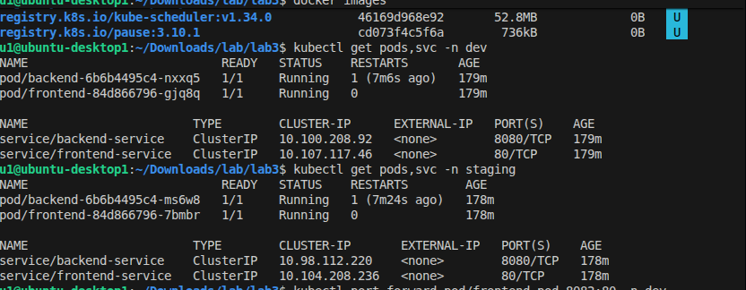
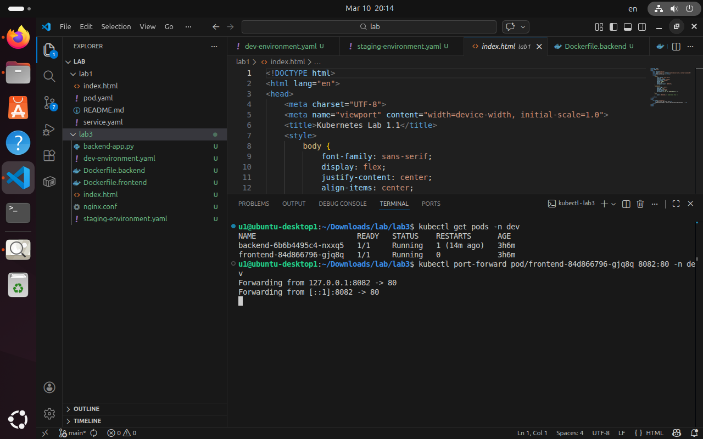

# Lab 3: Multi-Tenancy with Namespaces and Internal Routing

## Overview
This lab demonstrates:
- Using **Namespaces** for environment isolation (dev and staging)
- Deploying a **two-tier application** (backend + frontend)
- Internal routing using **ClusterIP Services**
- Port-forwarding to access frontend in browser

---

## Steps

1. Created namespaces: `dev` and `staging`
2. Deployed backend pods & services in each namespace
3. Deployed frontend pods in each namespace
4. Verified pod status and service connectivity
5. Port-forwarded frontend pods to access in browser

---

## Screenshots

### 1. Dev namespace pods and services

### 2. Staging namespace pods and services

### 3. Frontend application running in browser
